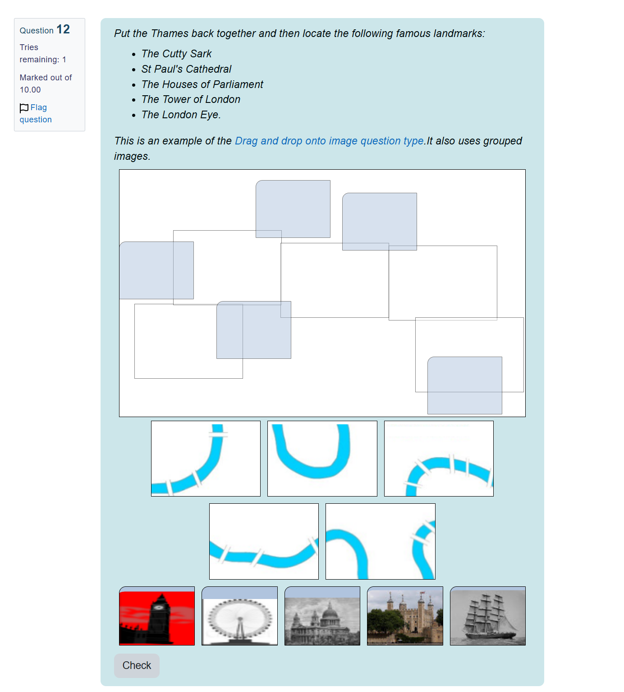
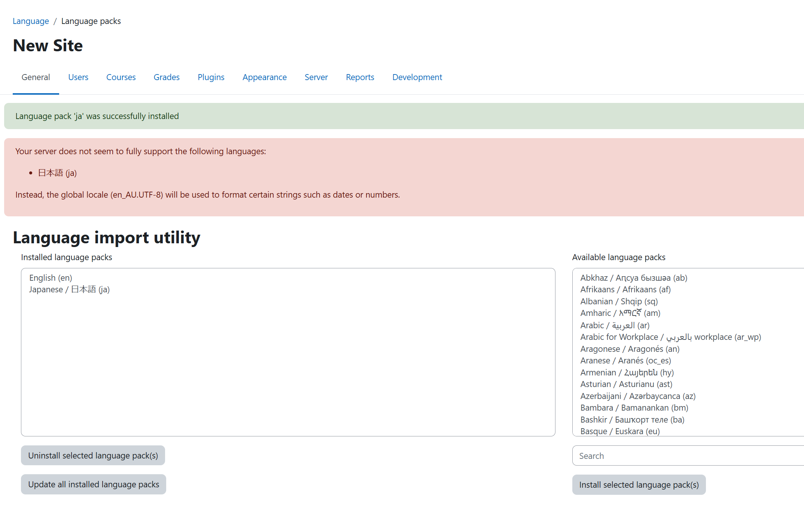

# moodleと遊ぼう

## まずは本家のデモサイト

https://moodle.org/demo

雰囲気を確認するのに便利です。
ただし、コンテンツの中身は英語だけです。
また、コースの中身は、当然ですが、本格的な学習リソースというほどの内容にはなっていません。

すべてのデモについて、1時間に1回環境がリセットされるとのこと。
既存のクイズを編集したりする操作も気軽に試せますが、じっくり実験するのには向きません。

> Each demo site is reset to its blank state every hour, on the hour. 

確認時点 (2024-12-07) では2つの例があります。

- Mount Orange School
- Moodle Sandbox

Mount Orange School は実際に学校等でe-Learningを行うケースを想定しているようです。

生徒役アカウントと先生役アカウントがあるのでどう見えるのか、どう使うのかのイメージを確認しやすいです

クイズ形式のデモは一見の価値ありです。計算問題とか、一部のCAPTCHAみたいなジグソーパズル風の問題まで出してます。へぇ

先生役アカウントである `teacher / moodle2024` でログインの上で以下ページを見てみるのが良いです
（生徒役でも授業にEnrollすれば回答形式で内容を確認できます）

https://school.moodledemo.net/mod/quiz/attempt.php?attempt=76&cmid=1210

問題のエクスポートといった評価もできます。

このレポジトリにエクスポート例のXMLを置いておきました。

デモとしては、さすが、きちんとしている印象。

## 手元のDockerで動かしてみる

WSL上で試す感じでやります。

個人的な意図としては、直接Linux上にインストールするオンプレっぽい形式ではなく、コンテナでレバレッジかけたいところがちょっとあります。

他方で、この手のシステムをPaaS風にするのは多くのユースケースで「割に合わない」ってことはあるかなと。
大学での利用事例が顕著だと思うんですが、そういう場合はクラウドネイティブというよりは学内インフラの活用が先に来ることが多いでしょうし、ストレージもNFS的なのだったりするんじゃないかなーとか。

あいにくMoodle本体は生のLinuxにインストールする古典的な方法しか扱ってません。
それはそれで上記の通り妥当なんですが、まずはDockerで動かしてみます。

https://hub.docker.com/r/bitnami/moodle

何も設定しないで `docker-compose up` した場合にはローカルファイル等としては永続化されません。
とりあえずその状態で遊びます

標準設定では user/password は記述の通り `user`/`bitnami` です。admin権限です。

最初はLanguage Packが入っていないので英語インターフェースしか選べません。
選びます

コンテナ上のLinuxのロケールが足りない臭い感じ。

本格的に使う場合にはDBを本当にMariaDBにするのか、また永続化ファイルの置き場所はどこが良いか（PaaS想定ならS3にどう置くのか）とかが論点になるかもしれません

## その他適当な情報

- https://www1.hus.ac.jp/~fukai/ QuEDIT クイズ作成